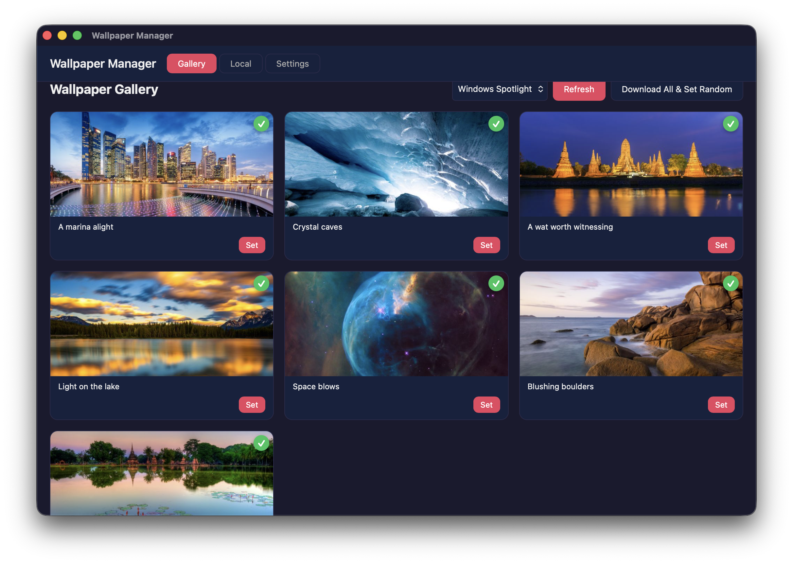

# wallpaper-mac

macOS desktop wallpaper manager. Fetches **Bing Daily** and **Windows Spotlight** wallpapers via the [Peapix API](doc/apis.md), with preview, download, and set-as-wallpaper functionality.



## Features

- Browse Bing Daily and Spotlight wallpapers from 12 regions
- Preview full-size images in a modal overlay
- Download wallpapers (UHD/HD) locally
- Set as macOS desktop wallpaper (System Events)
- "Download All & Set Random" — bulk fetch + random pick
- Skip-existing — downloads skip files already saved to disk
- Auto-refresh at configurable intervals

## Quick start

```sh
pnpm tauri dev
```

Opens the Vite dev server on port 1420 with Rust hot-reload.

## Build

```sh
pnpm tauri build --bundles app
```

Builds a standalone `.app` (skips DMG which often fails).

## Tech stack

| Layer | Technology |
|-------|-----------|
| Frontend | React 19, TypeScript, Vite 7 |
| Backend | Tauri v2 (Rust), reqwest |
| Wallpaper set | macOS `osascript` (System Events) |
| Storage | `~/Pictures/Wallpapers/` |

## Architecture

- `src/` — React frontend (Gallery, Preview, Settings, Local tabs)
- `src-tauri/src/lib.rs` — Tauri commands (fetch, download, set, settings)
- `doc/apis.md` — Peapix API reference

See `AGENTS.md` for detailed gotchas, debug commands, and component docs.
